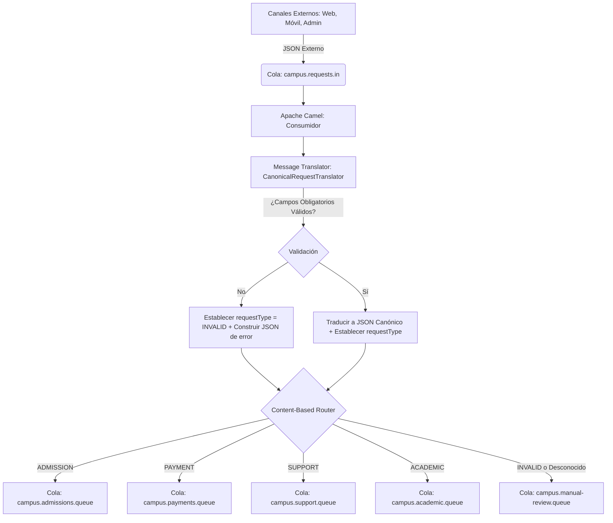

# Taller Semana 11 - Smart Campus Request Router

Este proyecto implementa una solución de integración basada en mensajería utilizando **Spring Boot**, **Apache Camel** y **RabbitMQ** para recibir, validar, transformar y enrutar solicitudes estudiantiles en un entorno universitario ("Smart Campus").

## Integrantes del Grupo
- [Nombre de Integrante 1]
- [Nombre de Integrante 2]

---

## 1. Descripción del Problema de Integración

El Smart Campus recibe solicitudes estudiantiles desde diversos canales digitales (páginas web, aplicaciones móviles, plataformas administrativas). Todas estas solicitudes ingresan inicialmente a una cola centralizada de mensajería (`campus.requests.in`).

El reto de integración consiste en:
1. **Consumir** los mensajes en formato JSON externo desde la cola central.
2. **Validar** que los campos obligatorios del mensaje existan y no estén vacíos.
3. **Traducir (Message Translator)** los mensajes válidos de un formato externo a un modelo canónico común interno, agrupando los datos del estudiante y saneando los nombres de atributos. Si el mensaje es inválido o no se puede procesar, se traduce a un formato de error estructurado.
4. **Enrutar (Content-Based Router)** el mensaje transformado a su cola específica de destino en función del valor del tipo de solicitud (`type` o `request_type`).
5. **Manejar fallos y excepciones**, dirigiendo los mensajes inválidos y no reconocidos (por ejemplo, tipos de solicitud inexistentes) a una cola de revisión manual (`campus.manual-review.queue`) sin detener la ejecución de las rutas de integración.

---

## 2. Diagrama de Flujo de Integración

El siguiente diagrama en Mermaid representa el flujo de integración de mensajes implementado en este taller:



---

## 3. Tecnologías Utilizadas

- **Java JDK 21**: Lenguaje de programación base.
- **Spring Boot 3.3.5**: Framework para la autoconfiguración de la aplicación.
- **Apache Camel 4.8.1**: Framework de integración basado en patrones de Enterprise Integration Patterns (EIP).
- **RabbitMQ 3-Management**: Broker de mensajería AMQP (ejecutándose en Docker).
- **Jackson (databind)**: Biblioteca para manipulación y transformación de JSON en Java.
- **Maven**: Gestor de construcción y dependencias.

---

## 4. Actividad Previa de Investigación (Sección 11)

### 11.1 Content-Based Router
1. **¿Qué problema resuelve este patrón?**
   El patrón *Content-Based Router* (Enrutador basado en el contenido) resuelve el problema de enviar un mensaje a diferentes destinos según el contenido del propio mensaje. Evita que el remitente tenga que conocer la estructura de los destinatarios o tomar decisiones de enrutamiento él mismo.
2. **¿Por qué es mejor que el productor no conozca todos los posibles destinos?**
   Reduce el acoplamiento (*loose coupling*). Si el productor tuviera que conocer todos los destinos, cualquier cambio en los canales receptores (agregar una nueva cola, cambiar un nombre, etc.) obligaría a modificar y recompilar el productor. Al desacoplarlos, el productor solo publica a un único punto de entrada y la infraestructura de integración gestiona las reglas de negocio de enrutamiento de forma independiente.
3. **¿Qué campo del mensaje se utilizará como criterio de decisión en este taller?**
   Se utiliza el campo `request_type` del mensaje original, el cual es mapeado al campo `type` en el modelo canónico y almacenado en la propiedad de intercambio `requestType` de Apache Camel.

### 11.2 Message Translator
1. **¿Qué problema resuelve este patrón?**
   Resuelve la incompatibilidad entre formatos de datos de diferentes sistemas. Permite que sistemas que usan diferentes estructuras o vocabularios de datos se comuniquen traduciendo el formato del emisor a un formato que el receptor pueda entender.
2. **¿Por qué dos sistemas pueden necesitar formatos distintos para representar la misma información?**
   Porque han sido desarrollados por diferentes equipos, en diferentes tecnologías, épocas, o con enfoques funcionales distintos. Por ejemplo, un formulario web externo puede estar diseñado para la facilidad de captura rápida del usuario (estructura plana), mientras que un sistema académico interno requiere una estructura jerárquica y validada (modelo canónico estructurado) para integrarse con bases de datos relacionales.
3. **¿Qué transformación concreta se realizará en este taller?**
   Se convertirá un JSON plano (con campos snake_case como `student_name` y `student_document`) en un JSON anidado (camelCase) donde la información del estudiante se agrupa en un objeto `student` con campos `fullName` y `document`, y se renombran campos como `request_id` a `requestId`, `channel` a `sourceChannel` y `created_at` a `createdAt`.

### 11.3 Canonical Data Model
1. **¿Qué es un modelo canónico?**
   Es un formato de datos común e independiente diseñado para la integración entre múltiples sistemas dentro de una organización. Define una estructura de datos estándar que todos los mensajes deben adoptar al viajar a través del bus de integración.
2. **¿Por qué puede reducir el acoplamiento entre sistemas?**
   Porque en lugar de escribir traductores específicos para cada par de sistemas que se comunican (lo cual escala de manera cuadrática $N \times (N-1)$), cada sistema solo necesita un adaptador para traducir su formato propio hacia/desde el modelo canónico común (escala de manera lineal $2N$).
3. **¿Cuál es el modelo canónico definido para este taller?**
   Es el JSON interno estructurado de la siguiente forma:
   ```json
   {
     "requestId": "...",
     "student": {
       "fullName": "...",
       "document": "..."
     },
     "type": "...",
     "sourceChannel": "...",
     "createdAt": "..."
   }
   ```

### 11.4 RabbitMQ
1. **¿Qué es una cola en RabbitMQ?**
   Es un búfer en memoria o disco que almacena mensajes enviados por productores hasta que son consumidos por los receptores. Las colas siguen una estructura FIFO (First-In, First-Out) básica.
2. **¿Qué diferencia existe entre exchange, queue y routing key?**
   - **Exchange**: Es el agente de enrutamiento de RabbitMQ. Recibe los mensajes de los productores y los redirige a las colas basándose en reglas (bindings).
   - **Queue**: El destino final donde se almacenan los mensajes hasta que un consumidor los extrae.
   - **Routing Key**: Una etiqueta de dirección asociada al mensaje que el Exchange utiliza para determinar a qué colas enrutarlo.
3. **¿Cómo se puede verificar que un mensaje llegó correctamente a una cola?**
   Se puede verificar a través de la interfaz de administración web (Management UI) inspeccionando la pestaña "Queues", usando la herramienta de línea de comandos `rabbitmqctl list_queues`, o consumiendo (haciendo un "Get Message") el mensaje directamente de la cola de forma no destructiva.

---

## 5. Instrucciones de Ejecución

### Requisitos previos
- Docker Desktop en ejecución.
- Java JDK 17 o superior instalado y configurado en el PATH.
- Maven instalado.

### Paso 1: Levantar RabbitMQ
En la raíz del proyecto, ejecute:
```bash
docker compose up -d
```
Verifique que el contenedor esté corriendo con `docker ps`. Puede acceder a la consola de administración en http://localhost:15672 (usuario: `guest`, contraseña: `guest`).

### Paso 2: Configurar Exchanges, Colas y Enlaces
Ejecute el script de inicialización desde una terminal de PowerShell:
```powershell
powershell -File .\scripts\setup-rabbitmq.ps1
```
*(O `./scripts/setup-rabbitmq.sh` si se encuentra en un entorno Unix/Bash).*

### Paso 3: Compilar el Proyecto
Compile el proyecto con Maven:
```bash
mvn clean package
```

### Paso 4: Ejecutar la Aplicación
Inicie el enrutador de integración ejecutando el archivo JAR compilado:
```bash
java -jar target/smart-campus-request-router-1.0.0.jar
```
*(También puede usar `mvn spring-boot:run` si no hay problemas de encoding en la consola).*

### Paso 5: Publicar Mensajes de Prueba
Abra otra terminal y ejecute el script para inyectar mensajes de prueba en RabbitMQ:
```powershell
powershell -File .\scripts\publish-messages.ps1
```
*(O `./scripts/publish-messages.sh` en entornos Unix/Bash).*

---

## 6. Reglas de Enrutamiento (Content-Based Router)

| Valor de `request_type` (Origen) | Tipo Canónico (`type`) | Cola Destino | Descripción |
| :--- | :--- | :--- | :--- |
| `ADMISSION` | `ADMISSION` | `campus.admissions.queue` | Solicitudes de admisión de estudiantes |
| `PAYMENT` | `PAYMENT` | `campus.payments.queue` | Registro y validación de pagos |
| `SUPPORT` | `SUPPORT` | `campus.support.queue` | Solicitudes de soporte técnico |
| `ACADEMIC` | `ACADEMIC` | `campus.academic.queue` | Consultas y trámites académicos |
| *Cualquier otro valor* (ej: `LIBRARY`) | *Tipo original* | `campus.manual-review.queue` | Mensaje no reconocido |
| *JSON Malformado o Incompleto* | `INVALID` | `campus.manual-review.queue` | Mensajes con errores de validación |

---

## 7. Preguntas de Reflexión Obligatorias (Sección 14)

1. **¿Qué problema resuelve el patrón Message Translator en este taller?**
   Resuelve la discrepancia entre el formato plano y con estilo snake_case provisto por los clientes web/móvil externos y el formato anidado camelCase exigido por el modelo de datos unificado del Smart Campus.
2. **¿Qué problema resuelve el patrón Content-Based Router en este taller?**
   Evita que el cliente (productor) deba saber qué sistema de backend maneja cada tipo de solicitud. El enrutador central de Camel examina el mensaje y decide dinámicamente el destino correcto.
3. **¿Por qué primero se transforma el mensaje y luego se enruta?**
   Para asegurar que todos los sistemas destino reciban la información estructurada bajo el modelo canónico común. Si enrutáramos antes de transformar, cada cola de backend recibiría el formato sucio original y se vería obligada a implementar su propio traductor local, rompiendo el desacoplamiento.
4. **¿Qué pasaría si cada productor tuviera que conocer todas las colas destino?**
   Se generaría un acoplamiento extremo. Si agregamos un nuevo tipo de solicitud (por ejemplo, `SCHOLARSHIP`), tendríamos que actualizar todos los productores existentes para que sepan a qué cola enviar dicho mensaje.
5. **¿Qué ventaja tiene usar un modelo canónico interno?**
   Facilita la mantenibilidad, escalabilidad y estandarización de los datos. Simplifica la adición de nuevos consumidores y productores a la arquitectura de integración, ya que solo tienen que acoplarse al formato canónico y no entre sí.
6. **¿Qué limitaciones tiene esta solución?**
   - Si la cola `campus.requests.in` recibe un volumen masivo de mensajes, el enrutador de Camel podría convertirse en un cuello de botella si se ejecuta en un solo nodo sin escalabilidad horizontal.
   - En caso de caída de la base de datos o fallo del enrutador Camel en medio de la transacción, el mensaje podría perderse si no se habilita confirmación explícita de recepción (ACK) en RabbitMQ.
7. **¿Cómo se podría mejorar el manejo de errores?**
   - Implementando una cola de tipo Dead Letter Exchange (DLX) para manejar fallos de red o errores de parseo irrecuperables.
   - Añadiendo políticas de reintento con retroceso exponencial (*exponential backoff*) y disyuntores (*circuit breakers*).
   - Generando alertas automáticas a través de canales de monitoreo (como Prometheus/Grafana) cuando ingresen mensajes en la cola `manual-review`.
8. **¿Qué cambios serían necesarios para soportar el nuevo tipo de solicitud `SCHOLARSHIP`?**
   - **RabbitMQ**: Crear la cola `campus.scholarship.queue` y su enlace (binding) al exchange `campus.exchange` con la routing key `campus.scholarship.queue`.
   - **Camel (Content-Based Router)**: Agregar una nueva cláusula `.when(exchangeProperty("requestType").isEqualTo("SCHOLARSHIP")).to(...)` en la clase `CampusRequestRoute`.
   - **Pruebas**: Agregar un caso de prueba en el script de publicación con el tipo `SCHOLARSHIP`.
9. **¿Qué riesgos tendría colocar toda la lógica de decisión en el productor del mensaje?**
   El productor tendría demasiada responsabilidad del negocio de enrutamiento de la red de la organización. Cualquier cambio de topología física en RabbitMQ afectaría al código del cliente. Además, no se podrían hacer auditorías, logs unificados ni transformaciones comunes en un punto central.
10. **¿Cómo se relaciona este taller con una arquitectura orientada a eventos?**
    Se basa en los mismos principios de asincronía y desacoplamiento. Cada solicitud estudiantil se comporta como un evento ("Se ha generado una solicitud de admisión") que es publicado en el broker. Los sistemas interesados reaccionan consumiendo de las colas de destino sin que el publicador original espere una respuesta síncrona.
